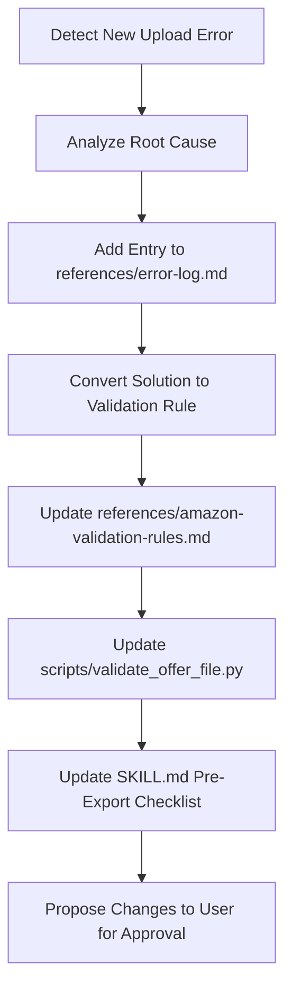

# Skill Auto-Renovation Workflow

Follow this workflow to update the skill instructions, validation rules, and scripts whenever a new upload error is identified.

## Step 1: Detect and Log the Error
1. Extract the error code, message, and target column from the Amazon Processing Report.
2. Run the helper script `update_error_log.py` or manually add a structured section to `references/error-log.md`:
   - Date
   - Affected Marketplace
   - File Type
   - Error Description
   - Amazon Error Message
   - Root Cause
   - Applied Fix
   - Prevention Strategy

## Step 2: Implement the Prevention Check
1. Translate the fix into a validation check.
2. Update `references/amazon-validation-rules.md` with the new rule details.
3. Edit the python validation script `scripts/validate_offer_file.py` to assert this new check on target Excel files before they are exported.

## Step 3: Update Guidelines and Checklists
1. Update the **Pre-Export Checklist** in `SKILL.md` to include a checkmark for this rule.
2. If necessary, update the `references/known-fixes.md` file with troubleshooting steps.

## Step 4: Propose Changes for Approval
- Present the draft updates of `SKILL.md` and scripts as an implementation plan/diff.
- **CRITICAL**: Do not overwrite active configurations or scripts without explicit user review. Allow the user to review the proposal and merge/save the changes once approved.
